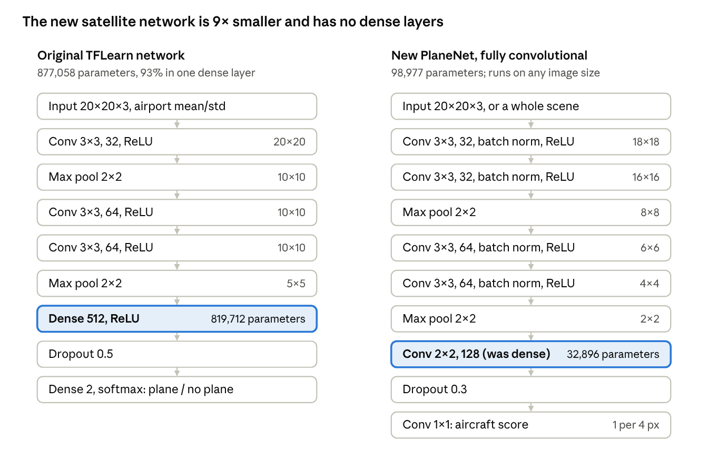
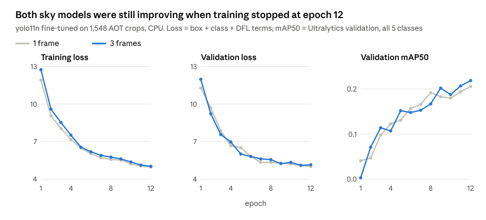
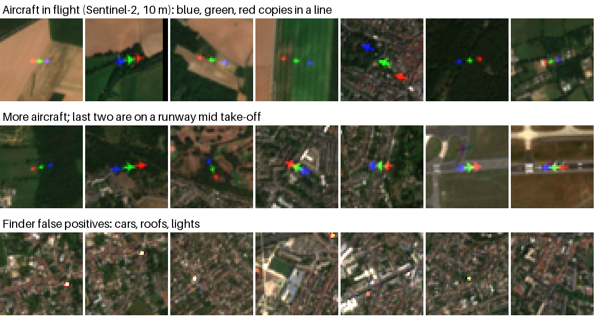
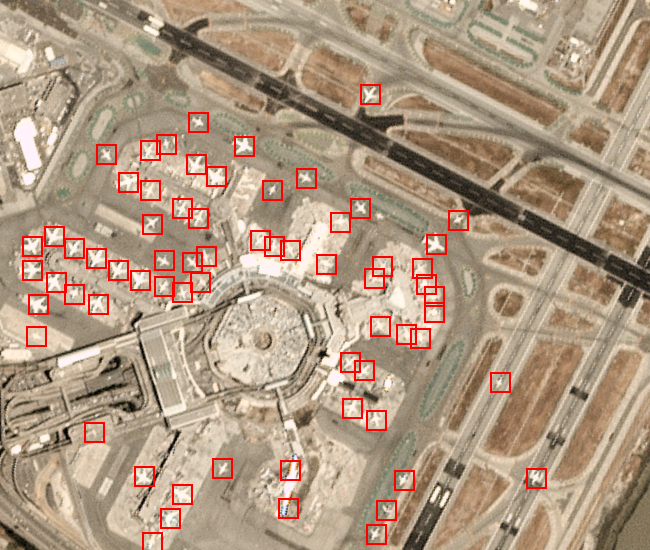
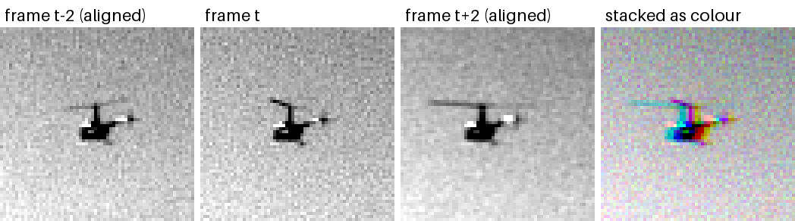
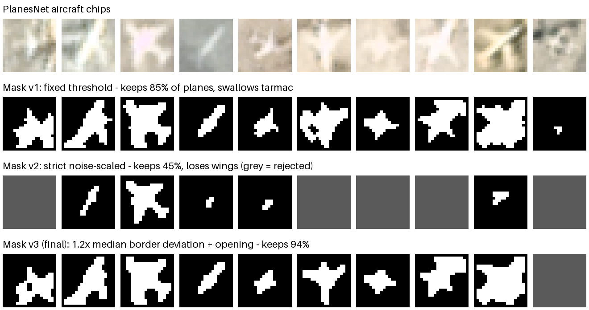
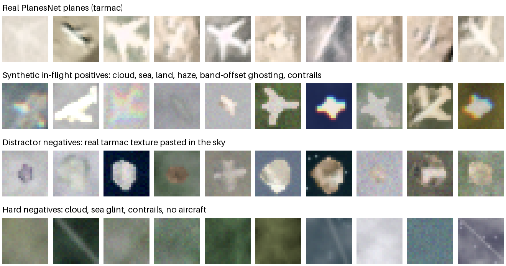
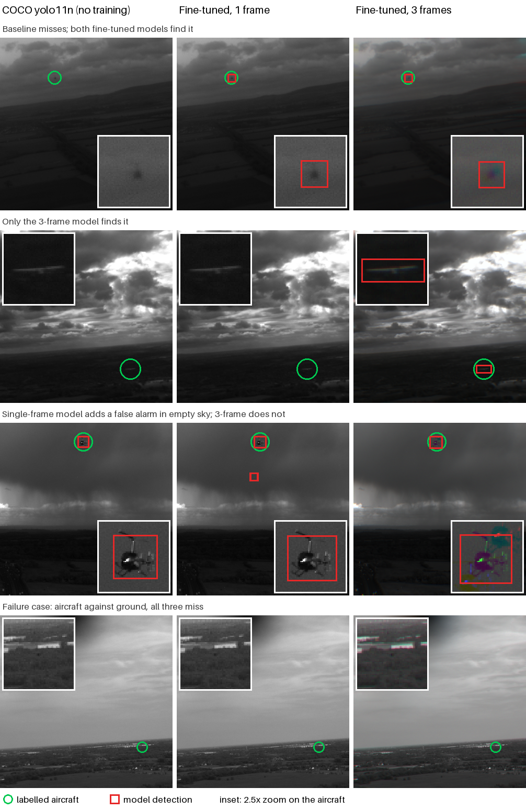

# Detecting Aircraft in Flight: Work Report

9 October 2026 · Rohan Shenoy. Live, editable version:
[claude.ai artifact](https://claude.ai/code/artifact/929d3d2e-ff1f-486a-9e78-f5a20b214491).

## Summary

Fine-tuning on real airborne footage raised aircraft detection from 0.11 to 0.58 average precision on held-out
flights, and feeding the model three frames instead of one cut false detections by about 40%.

The repo started as a PlanesNet classifier trained almost entirely on aircraft parked on tarmac. We need aircraft
in flight, against cloud, sea and ground clutter. In one day we rebuilt it in PyTorch as two pipelines:

- **Satellite** (looking down from orbit): a fully convolutional classifier trained on PlanesNet plus synthetic
  in-flight samples, with static-object suppression across dates and colour-band motion cues.
- **Sky** (cameras looking at aircraft): YOLO fine-tuned on Amazon's Airborne Object Tracking (AOT) dataset, with
  tiled inference, multi-frame tracking, and a 3-frame temporal input.

Everything is on branch `claude/fervent-pascal-x2ge7z` of `rohanshenoy/planesnet-detector`: 16 tests, about 2,100
lines, with a `CLAUDE.md` guide and this report in `docs/`. We also built a real test of aircraft in flight seen
from orbit (19 Sentinel-2 aircraft), where the satellite model finds 9 of 19, and scored the tracker on full video
clips, where an offline tracking pass cuts false alarms by 42% at no real cost in recall. Of two architecture
experiments, the larger `yolo11s` backbone raised average precision further to 0.63; an extra fine-detail detection
layer was worse after 12 epochs, too few for its untrained layers to catch up.

## Starting point

The original repo could not detect aircraft in flight: its training data, model and detector all assumed parked
aircraft on concrete.

| Part | Original | Problem for aircraft in flight |
| --- | --- | --- |
| Data | PlanesNet: 32,000 RGB chips, 20×20 px, from Planet satellite imagery at about 3 m per pixel | Almost every aircraft is parked or taxiing at an airport; no cloud, sea or haze backgrounds |
| Model | TFLearn CNN: 2 conv blocks, a 512-unit dense layer, normalised with statistics computed on the airport data | Learns "white cross on grey concrete"; the normalisation is tied to tarmac brightness |
| Detector | A 20 px window slid in 2 px steps, one model call per window (about 280,000 calls per scene), every hit boxed at 20×20 | Very slow, no score threshold, no use of motion |
| Stack | TensorFlow 1 and TFLearn, Python 3.5 | No longer installs on current Python |

The viewpoint question also mattered: "aircraft in flight" can mean looking down from a satellite or looking up
from a camera. These are different problems, so we built both.

## Dataset selection

We trained the sky pipeline on AOT, real footage of aircraft in flight, and the satellite pipeline on PlanesNet
plus synthetic in-flight samples, because no labelled satellite set of airborne aircraft was reachable.

| Dataset | Used for | Why chosen | Access |
| --- | --- | --- | --- |
| [Airborne Object Tracking (AOT)](https://registry.opendata.aws/airborne-object-tracking/), part 1 | Sky detector training and evaluation | Real aircraft-mounted video, 2448×2048 greyscale at about 10 frames per second, boxes for airplanes, helicopters, birds, drones; most targets under 20 px | Public S3 bucket, reachable directly |
| [PlanesNet](https://www.kaggle.com/rhammell/planesnet) | Satellite classifier: aircraft appearance from above | The only labelled aircraft-from-orbit set at hand: 8,000 plane chips, 24,000 without | Kaggle was blocked by the environment's network; supplied through a `data` branch |
| COCO-pretrained `yolo11n` / `yolo11s` weights | Starting point for the sky detector; also the baseline | Already knows "airplane" as a class | GitHub releases |
| Sentinel-2 L2A (public COGs on AWS) | Real test of aircraft in flight seen from orbit (`data/s2_airborne`) | Free; moving aircraft show a band-offset signature | Bucket listing per MGRS tile; the STAC search API was blocked |

Options considered and not used: **Planet imagery** matches PlanesNet's resolution but is not free; **OpenSky
ADS-B tracks** would locate aircraft in satellite scenes for labelling but need a research account.

**Splits.** AOT was split by flight, not by frame: 20% of flights (chosen by a hash of the flight id) are held out
for validation, so no flight, and no near-duplicate frame, appears in both sets. PlanesNet was split 80/20 at
random, and synthetic validation samples are built only from held-out chips.

## Data pruning and cleaning

AOT's 1.8 million label rows were pruned to 1,835 training crops, and PlanesNet's 8,000 aircraft to 7,489 clean
cut-outs, by the steps below.

### AOT (sky)

1. **Class mapping.** AOT names objects by instance (`Airplane3`, `Bird1`). We mapped them to five classes:
   airplane, helicopter, drone (the aircraft we score), bird, and unknown (AOT's unidentified `Airborne` objects).
   Birds and unknowns stay labelled so the model learns to tell them apart; in scoring they count neither for nor
   against.
2. **Frame selection.** Only frames with an aircraft and with both temporal neighbours (frames t−2 and t+2)
   available. At most 6 frames per flight, at least 20 frames apart, so no flight dominates and samples are not
   near-duplicates. About 15% of crops contain no object at all, as background negatives.
3. **Cropping.** Full 2448×2048 frames shrink a 6 px aircraft below one pixel at YOLO's 640 px input. Each sample
   is a 640×640 crop at native resolution, placed at random around an aircraft with a 32 px margin.
4. **Missing frames.** About 28% of frames referenced by the labels are missing from the bucket (HTTP 404). We
   over-planned by 35% and skipped failures: 2,565 planned, 730 skipped, 1,835 kept.

| Split | Crops | Aircraft boxes | Empty crops |
| --- | --- | --- | --- |
| Train | 1,548 | 1,357 | 202 |
| Validation (held-out flights) | 287 | 260 | 31 |

### PlanesNet (satellite)

1. **Aircraft cut-outs.** To place PlanesNet aircraft on cloud and sea, each plane is masked out of its chip. The
   first mask kept 85% of planes but often swallowed patches of textured tarmac. A stricter, noise-scaled
   threshold kept only 45% and lost wings. The final setting scales the threshold to each chip's own background
   variation (1.2× the median border deviation) and removes thin attachments: 7,489 of 8,000 planes kept with
   clean outlines.
2. **Distractor negatives.** Masks on low-contrast planes still carry some tarmac. So 30% of synthetic negatives
   are blobs of real ground texture pasted onto airborne backgrounds, which removes "tarmac in the sky means
   aircraft" as a shortcut.
3. **Hard negatives.** Procedural cloud, sea with sun glint, farmland, haze, and contrails with no aircraft.

## Architecture and layer changes

The satellite network got smaller and fully convolutional. The sky detector changed its input (three frames) and
was tested with a finer detection layer and a larger backbone.

### Satellite: PlaneNet

The original TFLearn network had 877,058 parameters, 93% of them in one dense layer. The new PlaneNet has 98,977,
about 9× fewer, and no dense layers:

1. Two 3×3 convolutions with 32 channels, batch norm and ReLU, then 2×2 max pooling: 20 px → 8 px.
2. Two 3×3 convolutions with 64 channels, then pooling: 8 px → 2 px.
3. A 2×2 convolution to 128 channels (the old dense layer, rewritten as a convolution), dropout, and a 1×1
   convolution to one score.

No convolution is padded and the pools are aligned. So on a full scene the same network outputs one score every
4 px, identical to classifying each 20×20 window separately (a unit test checks this). One forward pass replaces
about 280,000 model calls; a full 1225×1139 scene takes about 4 s on CPU. Batch norm replaces the
airport-specific input normalisation.



The old dense layer (left, highlighted) becomes a 2×2 convolution (right, highlighted) with 25× fewer parameters,
which is what lets the network slide across a whole scene in one pass.

### Sky: YOLO variants

| Model | Parameters | Input | Detection layers (px per cell) | Status |
| --- | --- | --- | --- | --- |
| `yolo11n`, COCO weights (baseline) | 2.62 M | 1 frame | 8, 16, 32 | Evaluated, no training |
| `yolo11n` fine-tuned | 2.62 M | 1 frame | 8, 16, 32 | Trained and evaluated |
| `yolo11n` fine-tuned, temporal | 2.62 M | 3 frames | 8, 16, 32 | Trained and evaluated |
| `yolo11n-p2`, temporal | 2.74 M | 3 frames | **4**, 8, 16, 32 | Trained and evaluated |
| `yolo11s`, temporal | 9.46 M | 3 frames | 8, 16, 32 | Trained and evaluated |

**Temporal input.** AOT is greyscale, so the three colour channels are free. We fill them with frames t−2, t and
t+2. Each neighbour is first aligned to frame t by phase correlation, to cancel the camera's own motion, and
brightness-matched. Static scenery then comes out grey, while anything moving relative to it leaves a coloured
fringe. No layer changes; hue and saturation augmentation is switched off because it would scramble the time
channels.

**Fine-detail layer (P2).** YOLO's finest standard layer has one cell per 8 px, so a 6 px aircraft is smaller than
one cell. No YOLO11 configuration with a 4 px layer existed, so we wrote one (`sky/models/yolo11-p2.yaml`). It is
identical to YOLO11 up to the 8 px output, then adds one more upsampling stage joined to the backbone's 4 px
features, and a fourth detection output. 297 of 593 weight tensors transfer from the pretrained model; the new
layers start untrained.

**Larger backbone.** `yolo11s` has the same layer structure with twice the channels: 3.6× the parameters and 3.3×
the compute.

## Training and loss curves

All sky runs used the same recipe, so their curves compare directly: 12 epochs at 640 px, batch 16, from COCO
weights, on a 4-core CPU (about 6 minutes per epoch for `yolo11n`).



Validation loss more than halved, and mAP50 roughly quintupled and was still rising at the last epoch, so longer
training is the cheapest next gain. The two models swapped the lead several times; the 3-frame model led in each
of the last four epochs. These mAP50 values count all five classes with box-overlap matching, so they run lower
than the aircraft-only scores in Results.

| Setting | Sky (YOLO) | Satellite (PlaneNet) |
| --- | --- | --- |
| Loss | Box (CIoU) + classification (BCE) + distribution focal loss | Binary cross-entropy |
| Optimiser | Ultralytics automatic choice, warm-up | AdamW, learning rate 0.001, one-cycle schedule |
| Batch, epochs | 16, 12 | 256, 20 |
| Augmentation | Mosaic (off for the last 3 epochs), flips, ±10° rotation, ±30% scale; hue and saturation off for 3-frame input | 90° rotations, flips, haze, blur, brightness, noise; synthetic in-flight samples each epoch |

The satellite run converged smoothly: training loss fell from 0.43 to 0.037 over 20 epochs, and held-out PlanesNet
AUC rose from 0.976 to 0.998. The fine-detail (P2) run started much higher (validation loss 24.5 at epoch 1, as its new
layers are untrained) and ended at 7.5, still falling about 0.1 to 0.4 per epoch. The `yolo11s` run was interrupted by a container
restart after epoch 10 and resumed from its checkpoint for the last 2 epochs. Its validation loss fell from 7.1 to 4.6
(with one unstable spike at epoch 2), the lowest of all runs, and its validation mAP50 ended at 0.276, the highest.

## Results

On 260 aircraft from flights no model trained on, fine-tuning lifted average precision from 0.11 to 0.55, and the
3-frame input took it to 0.58 with 70% precision.

### Sky detector on held-out AOT flights

| Model | Average precision | Precision / recall at best F1 | Recall, sky background | Recall, ground background | Recall, targets under 10 px |
| --- | --- | --- | --- | --- | --- |
| `yolo11n` COCO, no training | 0.11 | 52% / 12% | 17% | 2% | 0% |
| `yolo11n` fine-tuned, 1 frame | 0.55 | 58% / 57% | 75% | 28% | 26% |
| `yolo11n` fine-tuned, 3 frames | **0.58** | **70% / 58%** | 74% | 30% | 28% |

Groups: 160 aircraft against sky, 97 against ground (3 unlabelled), 98 under 10 px, 162 at 10 px or more.

**How it is scored.** A prediction is a hit when its centre lies within the larger of 8 px and half the box size of
a real aircraft's centre. Box overlap (IoU) is not used: on a 6 px target, a 2 px offset alone ruins the overlap
score. Predictions on birds and unidentified objects are ignored. Precision and recall are read at the confidence
threshold with the best F1 score.

**What the numbers say.**

- Fine-tuning on real airborne footage is the big gain: 5× the average precision, and tiny aircraft go from never
  found to about one in four.
- The 3-frame input mostly cuts false alarms: at the same 58% recall, false detections fall from about 107 to 63.
  Its 2-point gains on ground backgrounds and tiny targets are about 2 aircraft each, within the noise of a single
  training run.
- Aircraft against ground clutter (30%) and under 10 px (28%) remain the weak spots.

**Larger and finer models, same 3-frame data and recipe:**

| Model | Average precision | Precision / recall at best F1 | Recall, sky background | Recall, ground background | Recall, targets under 10 px |
| --- | --- | --- | --- | --- | --- |
| `yolo11n`, 3 frames (from the table above) | 0.58 | 70% / 58% | 74% | 30% | 28% |
| `yolo11s`, 3 frames (3.6× parameters) | **0.63** | **76% / 54%** | 67% | **33%** | 26% |
| `yolo11n-p2`, 3 frames (extra 4 px layer) | 0.41 | 56% / 44% | 58% | 21% | 12% |

- **The larger backbone ranks aircraft better** (average precision 0.63 against 0.58) and reaches 76% maximum recall
  against 72%. Its best F1 is the same as `yolo11n`'s (0.63), reached at higher precision and slightly lower recall,
  so the per-group recalls move with the operating point: better on ground, worse on sky. It is also the only model
  whose validation mAP50 was still rising sharply at the last epoch (0.229 to 0.276).
- **The fine-detail layer is worse everywhere at 12 epochs**, including the tiny targets it was built for. This is not
  a verdict on the layer: about half its weights started untrained, and its validation loss was still falling steeply
  (7.5 at epoch 12, against 5.1 for `yolo11n`). Comparing them needs the longer GPU run.

### Tracker on full video clips

On full frames, an offline tracking pass keeps nearly every hit and cuts false alarms by about 40%; live
confirmation cuts them further but loses over half the aircraft.

The crop scores above use 640 px crops placed around aircraft. `sky/evaluate_clips.py` instead runs the detectors
on full 2448×2048 frames, tiled at native resolution: 8 continuous clips of 50 frames from 8 held-out flights, 400
aircraft instances. Each detector is scored three ways:

- **Raw:** every detection above the model's threshold.
- **Live:** only detections whose track is already confirmed at that frame, as `sky/detect.py` draws them.
- **Offline:** every detection of a track confirmed at any point, as a post-processing pass would keep them.

| Model and output | Aircraft found | Precision | False alarms per frame |
| --- | --- | --- | --- |
| 1 frame, raw | 49% | 37% | 0.83 |
| 1 frame, offline (5 hits) | 46% | 49% | 0.49 |
| 3 frames, raw | 47% | 52% | 0.44 |
| 3 frames, offline (5 hits) | 47% | **65%** | 0.26 |
| 3 frames, live (5 hits to confirm) | 18% | 72% | 0.07 |
| 3 frames, live (2 hits to confirm) | 27% | 64% | 0.15 |

- **Time helps twice.** The 3-frame input halves raw false alarms on full frames (0.83 to 0.44 per frame), and
  offline tracking cuts them by another 42%, at a cost of 1 point of recall.
- **Live confirmation is expensive.** The detector catches a given aircraft in only about half of all frames, so
  tracks keep breaking and restarting their confirmation count. Fewer required hits recovers some recall at the
  cost of more false alarms.
- **Full frames are harder than crops.** Recall is 47% here against 58% on crops: whole frames carry far more
  clutter, and these clips include aircraft over 1.5 km away. One clip had a 16 px aircraft at 1.6 km that both
  models missed even on a crop centred on it.

### Satellite classifier

The satellite model scores 0.999 AUC on synthetic in-flight validation, but finds only 9 of 19 real aircraft in
flight on Sentinel-2. The synthetic score badly overstates real performance.

Training ran 20 epochs, about 4 minutes each. Final held-out scores: PlanesNet 98.6% accuracy (AUC 0.998),
synthetic in-flight 98.8% (AUC 0.999).

**Real test: aircraft in flight on Sentinel-2.** We built `data/s2_airborne` from 10 clear Sentinel-2 scenes (June
to August 2025) around Heathrow, Gatwick, Paris CDG, Frankfurt, Chicago O'Hare and New York JFK. A band-offset
finder proposed 81 candidates: a moving aircraft appears as blue, green and red copies in a line, because the bands
are captured a fraction of a second apart. Each candidate was labelled by eye: 14 aircraft (2 on a runway mid
take-off), 5 probable, and 62 clutter. 250 random chips from the same scenes were added as background. The finder's
own precision is 17% (23% counting probables).



At Sentinel-2's 10 m pixels, the three colour copies sit 3 to 40 px apart, wider than the model's 60 m window. So
we scored two inputs: the window around the green copy as-is, and the same window after shifting red and blue back
onto green (motion compensation, like the frame alignment for video).

| Input | Aircraft found at 0.5 (of 19) | AUC vs background | AUC vs clutter | False alarms at 0.5: clutter / background |
| --- | --- | --- | --- | --- |
| As-is | 47% | 0.99 | 0.88 | 8% / 0.8% |
| Bands realigned | 63% | 0.94 | 0.38 | 68% / 0.8% |

As-is, the model separates real aircraft from background and most clutter, but finds only half of them.
Realigning helps recall but merges unrelated coloured specks on clutter into a white blob, so it is only usable
once motion is confirmed by other means. With 19 positives, all of these numbers carry wide error bars.

**Full-scene sanity check.** On the repo's San Francisco airport scene (Planet, about 3 m), the final model at
threshold 0.9 boxes the parked aircraft with a handful of misfires on terminal buildings, so the airborne training
did not break tarmac detection.



## Examples

### The 3-frame input



A helicopter from a held-out flight, zoomed 4×. After alignment the sky is identical in all three frames and stacks
to grey. The helicopter moved relative to it, so its rotor and body leave cyan, magenta and yellow fringes: a
motion cue no single frame carries.

### Plane mask iterations (PlanesNet)



The same ten aircraft under each mask setting; grey means the chip was rejected. Version 1 keeps most planes but
grabs tarmac (columns 1, 6 and 9). Version 2 is clean but keeps only fuselages and rejects half the planes.
Version 3 keeps the plane silhouette (column 6) and 94% of planes.

### Synthetic satellite training samples



Each 20×20 chip zoomed 6×. Row 2 shows real PlanesNet aircraft moved into the air; the rainbow edges simulate the
band-offset ghosting of a fast-moving aircraft. Rows 3 and 4 are negatives: tarmac pasted in the sky, then cloud,
sea glint and contrails with no aircraft.

### Sky detections on held-out flights



Each model at its own best-F1 confidence threshold, on flights none of them trained on. Rows 1 to 3 show the three
ways fine-tuning and the 3-frame input help. Row 4 is a typical failure: a small aircraft against ground clutter,
which all three miss; 70% of aircraft against ground are still missed.

## Bugs fixed, limitations, next steps

The biggest limit on these results is compute: every model was trained for 12 epochs on a 4-core CPU, and all were
still improving when training stopped.

### Bugs found and fixed during the work

| Where | Symptom | Fix |
| --- | --- | --- |
| Sky tiled inference | An object cut by a tile edge was reported twice: once truncated, once whole | Drop tile detections touching an interior tile edge; the tile overlap guarantees a whole copy elsewhere |
| Satellite peak finding | Hung for over 10 minutes on a full scene when the model fired widely | Keep only local maxima before spacing them out |
| PlanesNet masks | Cut-outs carried tarmac into the sky | Noise-scaled threshold plus distractor negatives (see Data pruning) |
| AOT download | 28% of frames missing from the bucket | Over-plan samples by 35% and skip failures; clip evaluation retries other clips |
| Clip scoring | "Offline" output found fewer aircraft than "live" | Count every track confirmed at any frame, not only those still confirmed at the end of the clip |
| README | Training command broke the shell (comments after line continuations) | Rewritten |

### Limitations

- **One run per model.** Differences of a few points in a subgroup (about 2 aircraft) cannot be separated from
  run-to-run noise.
- **Small data.** 1,548 training crops, from part 1 of AOT only. AOT has hundreds of thousands of labelled frames
  across three parts.
- **A small real satellite test set.** 19 aircraft in flight on Sentinel-2, at 10 m resolution where PlanesNet is
  about 3 m. Good enough to show the synthetic score overstates real performance, not to measure it precisely.
- **Live tracking loses recall.** With per-frame recall near 50%, tracks fragment; the tracker's gating and
  straightness rule were not tuned for a moving camera.

### Next steps, by expected gain

1. A GPU run: about 50 epochs on 10,000 to 20,000 AOT crops. The scripts already take these as arguments.
2. Grow the Sentinel-2 set to a few hundred aircraft (more airports and dates, or ADS-B matching), then train a
   Sentinel-2 model on the band-offset signature itself, with 10 m inputs and a window wide enough to hold all
   three colour copies.
3. Tune tracking for a moving camera: compensate camera motion before gating, and allow longer gaps so tracks
   survive missed frames.
4. Five-frame temporal input or a wider frame gap, aimed at the tiny targets.

## Reproducing

```bash
pip install -r requirements.txt
python -m pytest -q

# Sky
curl -o groundtruth.csv https://airborne-obj-detection-challenge-training.s3.amazonaws.com/part1/ImageSets/groundtruth.csv
python -m sky.prepare_aot groundtruth.csv data/aot --train 1500 --val 400
python -m sky.finetune data/aot/single.yaml --imgsz 640 --epochs 12 --batch 16 --close-mosaic 3 --name single
python -m sky.finetune data/aot/temporal.yaml --temporal --imgsz 640 --epochs 12 --batch 16 --close-mosaic 3 --name temporal
python -m sky.evaluate runs/sky/temporal/weights/best.pt data/aot/temporal --meta data/aot/meta.json
python -m sky.evaluate_clips groundtruth.csv data/aot_clips --clips 8 --length 50 \
    --model single=runs/sky/single/weights/best.pt:0.167 --model temporal=runs/sky/temporal/weights/best.pt:0.183:2

# Satellite
python -m satellite.train --planesnet planesnet.json --out models/plane.pt --epochs 20
python -m satellite.evaluate_s2 models/plane.pt data/s2_airborne
```
